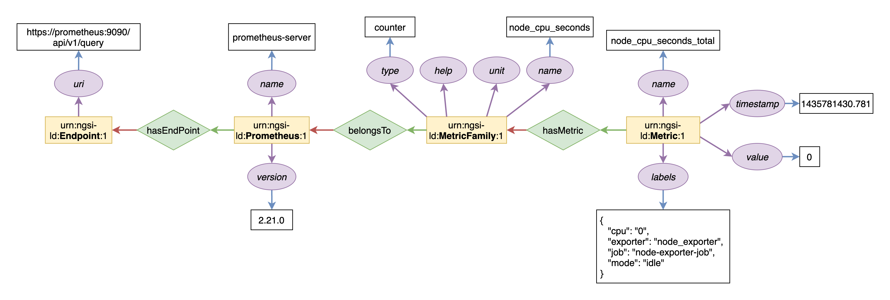
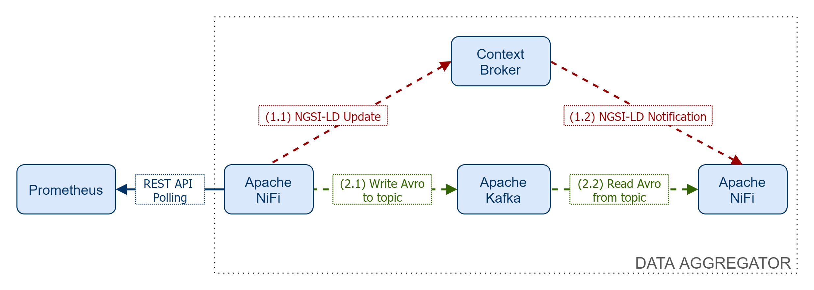

# cim-prometheus-pipelines

This repository contains a containerized scenario to run performance experiments using [Prometheus](https://prometheus.io) as a monitoring data source. The results extracted from the experiments will help us validate the ingestion stage implemented in our proposed monitoring data aggregation system.

# Prometheus NGSI-LD Information Model

The target data source for our experiments is the Prometheus TSDB. The following figure depicts an NGSI-LD information model instance of the context information associated to a Prometheus data source.



# Experiments

Our proposed data aggregation system is loosely-coupled from the data sources. Thus, we must implement collection data mechanisms that require no intervention from the data source owner. When it comes to Prometheus, the only way of collecting metrics is by querying the [Prometheus's REST API](https://prometheus.io/docs/prometheus/latest/querying/api/). To this end, we propose implementing an HTTP polling mechanism that collects metrics from Prometheus REST API at particular pace. Once the metrics have been collected from Prometheus, the data must to be transformed into a consumable format by the NGSI-LD context broker. [Apache NiFi](https://nifi.apache.org) framework has been chosen to fulfil this role. The following figure displays a scenario where NiFi collects data from Prometheus. NiFi transforms the metric data into the NGSI-LD model that was previously shown, and sends the encoded data to the Context Broker.



On the other hand, an NGSI-LD subscription has been created on behalf of a consumer represented by NiFi. Therefore, upon creating and/or updating metrics within the Context Broker, a NGSI-LD notification is sent to NiFi. In order to consume and process such notification, NiFi has to implement a mechanism able to receive HTTP messages.

# Docker Testbed

To run the experiments, we have built Docker-based testbed. We leverage docker-compose to ease the process of setting up the components of the testbed as microservices. The default scenario runs NGSI-LD Scorpio broker, although this should be extended in order to include other NGSI-LD Context Broker implementations.

## Requirements

- Docker (_Tested with version 19.03.13_)
- Docker-compose (_Tested with version 1.27.4_)

## Quick Start

### Scorpio Scenario

Start the prototype by running docker-compose:
```bash
docker-compose -f scorpio-compose.yml up
```

In case you are interested in running the prototype in background (kafka or scorpio logs may be annoying), use the following command:
```bash
docker-compose -f scorpio-compose.yml up -d
```

Once you are done running tests, tear the scenario down by issuing the following command - run the command twice in case the executions gets stuck at some service:
```bash
docker-compose -f scorpio-compose.yml down
```

To subscribe to NGSI-LD TimeSeries entities from NiFi, run the following query using the cURL command:
```
curl --location --request POST 'http://localhost:9090/ngsi-ld/v1/subscriptions/' \
--header 'Content-Type: application/json' \
--header 'Link: <http://context-catalog:8080/context.jsonld>; rel="http://www.w3.org/ns/json-ld#context"; type="application/ld+json"' \
--data-raw '{
    "id": "urn:ngsi-ld:Subscription:TimeSeries:scorpio-subs",
    "type": "Subscription",
    "entities": [{
        "type": "TimeSeries"
    }],
    "notification": {
        "endpoint": {
            "uri": "http://nifi:18080/notify",
            "accept": "application/json"
        }
    }
}'
```

To delete subscriptions to NGSI-LD TimeSeries entities from NiFi, run the following query using the cURL command:
```
curl --location --request DELETE 'http://localhost:9090/ngsi-ld/v1/subscriptions/urn:ngsi-ld:Subscription:TimeSeries:scorpio-subs'
```

### Orion-LD Scenario

Start the prototype by running docker-compose:
```bash
docker-compose -f orion-compose.yml up
```

In case you are interested in running the prototype in background, execute the following command:
```bash
docker-compose -f orion-compose.yml up -d
```

Once you are done running tests, tear the scenario down by issuing the following command - run the command twice in case the executions gets stuck at some service:
```bash
docker-compose -f orion-compose.yml down
```

To subscribe to NGSI-LD TimeSeries entities from NiFi, run the following query using the cURL command:
```
curl --location --request POST 'http://localhost:1026/ngsi-ld/v1/subscriptions/' \
--header 'Content-Type: application/json' \
--header 'Link: <http://context-catalog:8080/context.jsonld>; rel="http://www.w3.org/ns/json-ld#context"; type="application/ld+json"' \
--data-raw '{
    "id": "urn:ngsi-ld:Subscription:TimeSeries:orion-subs",
    "type": "Subscription",
    "entities": [{
        "type": "TimeSeries"
    }],
    "notification": {
        "endpoint": {
            "uri": "http://nifi:18080/notify",
            "accept": "application/json"
        }
    }
}'
```

To delete subscriptions to NGSI-LD TimeSeries entities from NiFi, run the following query using the cURL command:
```
curl --location --request DELETE 'http://localhost:1026/ngsi-ld/v1/subscriptions/urn:ngsi-ld:Subscription:TimeSeries:orion-subs'
```

### Kafka Scenario

Start the prototype by running docker-compose:
```bash
docker-compose -f kafka-compose.yml up
```

In case you are interested in running the prototype in background (kafka logs may be annoying), use the following command:
```bash
docker-compose -f kafka-compose.yml up -d
```

Once you are done running tests, tear the scenario down by issuing the following command - run the command twice in case the executions gets stuck at some service:
```bash
docker-compose -f kafka-compose.yml down
```

