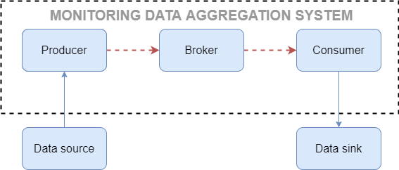
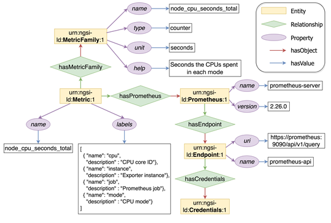
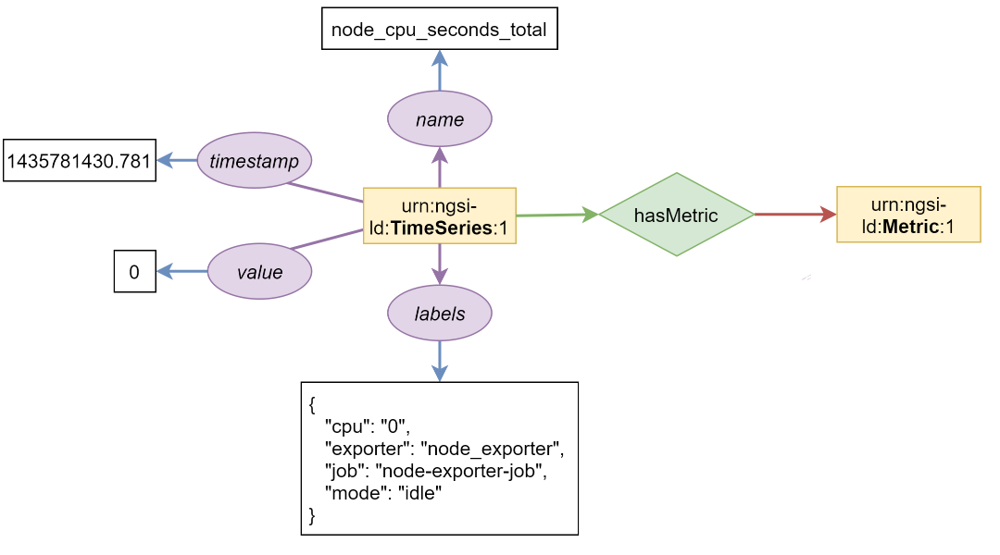
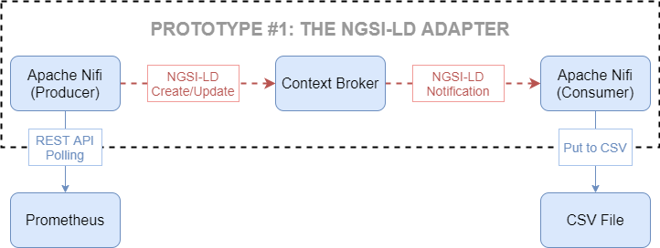
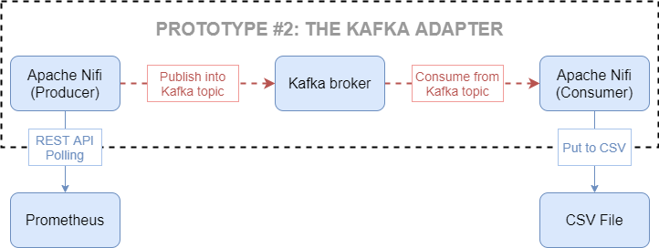
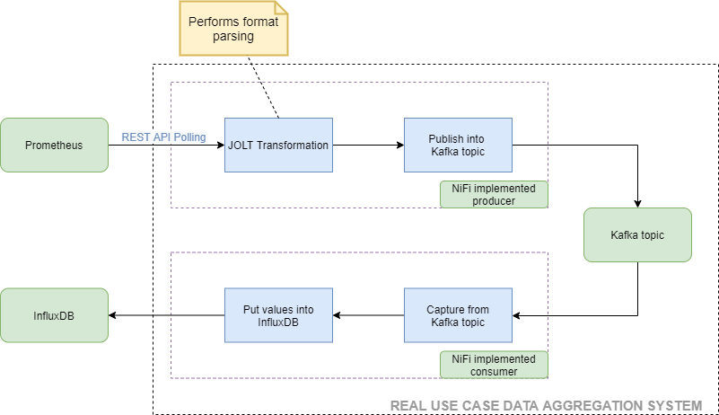
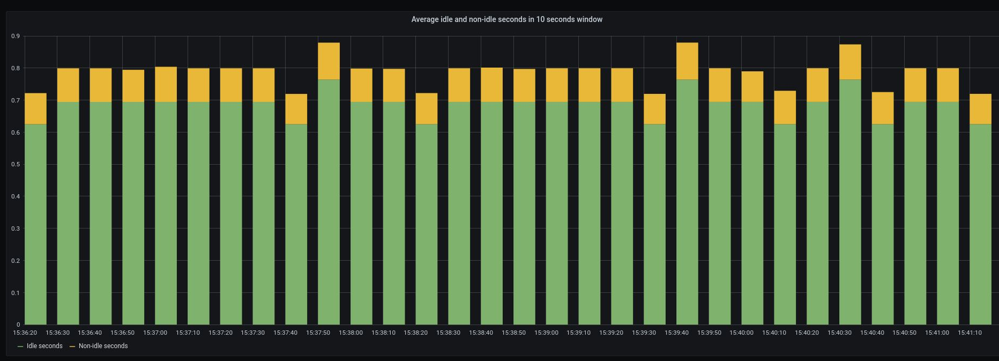

# cim-prometheus-pipelines

5G networks have led to an increase in the complexity of the management plane. In order to achieve a smart and efficient management of 5G networks, new monitoring mechanisms are required. The main problem is the huge number of data sources that exist and their heterogeneity, with their own mechanisms and formats to represent the information. We will leverage the ETSI ISG Context Information Management framework (CIM) standard, which will enable high interoperability with other monitoring systems.

In this work, we propose a generic architecture which allows us to aggregate and unify all this data to distribute it among interested subscribers with different purposes (e.g., data analysis, visualization). The architecture looks like this:



In this repository, we are going to give different implementations of the generic architecture showed above, all of them using [Prometheus](https://prometheus.io) as a monitoring data source. Some of those implementations will be used to run performance experiments. The results extracted from the experiments will help us validate the ingestion stage implemented in our proposed monitoring data aggregation system. The last scenario will be a real use case using [Grafana](https://grafana.com) and [InfluxDB](https://www.influxdata.com/)  to visualize the monitoring information coming from Prometheus.


<!-- TOC start -->
### Table of Contents
- [Prometheus NGSI-LD Information Model](#prometheus-ngsi-ld-information-model)
- [Experiments](#experiments)
  * [The NGSI-LD adapter](#the-ngsi-ld-adapter)
    + [Scorpio Scenario](#scorpio-scenario)
    + [Orion-LD Scenario](#orion-ld-scenario)
  * [The Kafka adapter](#the-kafka-adapter)
    + [Kafka-Avro Scenario](#kafka-avro-scenario)
    + [Kafka-NGSI-LD Scenario](#kafka-ngsi-ld-scenario)
- [Real use case scenario](#real-use-case-scenario)
<!-- TOC end -->


# Prometheus NGSI-LD Information Model

The target data source for our experiments is the Prometheus TSDB. The following figure depicts an NGSI-LD information model instance of the context information associated to a Prometheus data source.



Along with its context, the actual metric we are going to collect from Prometheus has been modeled as well.



# Experiments
For the experiments, we have developed 2 systems and 2 variants for each of them (total of 4 scenarios). The developed prototypes follow the Data Source – Producer – Broker – Consumer – Data Sink schema defined previously. The election of the Broker will be the key fact that will distinguish the two systems. For one of them, we have chosen a NGSI-LD Context Broker following the ETSI ISG CIM framework, and for the other one we have chosen Apache Kafka.

For the comparison experiments, we are going to measure the latency between the capturing and the notification of the Prometheus metric. To this end, the Producer must record the capturing timestamp in a field of the data that the Consumer is going to receive. This value will be written along with the notification timestamp in the CSV File, which will be the Data Sink in both cases, to calculate the latency.

Due to the broad usage of containers in 5G, we have decided to choose Docker Compose (_Tested with version 1.27.4_) to run all these components inside Docker (_Tested with version 19.03.13_), so that the deployment of the system could be easily done in almost any environment.

Our proposed data aggregation system is loosely-coupled from the data sources. Thus,  we must implement collection data mechanisms that require no intervention from the data source owner. When it comes to Prometheus, the only way of collecting metrics is by querying the [Prometheus's REST API](https://prometheus.io/docs/prometheus/latest/querying/api/). To this end, we propose implementing an HTTP polling mechanism that collects metrics from Prometheus REST API at particular pace. Once the metrics have been collected from Prometheus, the data must to be transformed into a consumable format by the correspondant Broker. [Apache NiFi](https://nifi.apache.org) framework has been chosen to fulfil this role in all 4 scenarios.

Now we are going to depict the 2 systems with the 2 variants each, which are:
- **System #1: The NGSI-LD adapter**
	- Scorpio scenario
	- Orion-LD scenario
- **System #2: The Kafka adapter**
	- Kafka-Avro scenario
	- Kafka-NGSI-LD scenario

All 4 scenarios will consist in a combination of a docker-compose file and a NiFi template file. These scenarios will automatically measure the latency. For the measurement of the CPU and memory usage, we can use the [collect_docker_stats.sh](collect_docker_stats.sh) utility (see the script usage for more information). The following example collects CPU and memory percentage usage stats for the kafka container when 60 events are sent every second in the kafka-avro scenario:

```bash
./collect_docker_stats.sh kafka-avro-scenario kafka 60
```

## The NGSI-LD adapter

The NGSI-LD adapter uses an ETSI ISG CIM platform and the NGSI-LD protocol as shown in the following diagram:



As we can see, the operations in this figure are a direct mapping from the one defined in the previous chapter, where:
 - The Data Source is Prometheus (as expected).
 - The Producer is a custom implementation in NiFi.
 - The Broker is a ETSI ISG CIM Context Broker (thus, the two variants: Scorpio or Orion-LD).
 - The Consumer is a custom implementation in NiFi.
 - The Data Sink is a CSV file.

The NiFi Consumer consists of a HTTP server exposing an endpoint in a certain port of the NiFi container. To receive notifications, the Consumer has to be previously subscribed to the notification service of the Context Broker. To do so, a subscription must be sent to the Context Broker, and it will be valid until revoked. We have provided a subgroup inside the NiFi template to ease the task, but we can use any HTTP Client like for example, cURL:
```bash
curl --location --request POST 'http://localhost:9090/ngsi-ld/v1/subscriptions/' \
--header 'Content-Type: application/json' \
--header 'Link: <http://context-catalog:8080/context.jsonld>; rel="http://www.w3.org/ns/json-ld#context"; type="application/ld+json"' \
--data-raw '{
    "id": "urn:ngsi-ld:Subscription:TimeSeries:context-broker-subs",
    "type": "Subscription",
    "entities": [{
        "type": "TimeSeries"
    }],
    "notification": {
        "endpoint": {
            "uri": "http://nifi:18080/notify",
            "accept": "application/json"
        }
    }
}'
```

Now we are going to explain the two scenarios derived from this first system and how to set them up to perform the experiments.

### Scorpio Scenario
The Context Broker in this scenario is the [Scorpio Broker](https://github.com/ScorpioBroker/ScorpioBroker).

Start the prototype by running docker-compose:
```bash
docker-compose -f scorpio-compose.yml up
```

In case you are interested in running the prototype in background (logs may be annoying), use the following command:
```bash
docker-compose -f scorpio-compose.yml up -d
```

With the prototype running, you have to upload the [nifi-templates/prometheus-ngsi-ld-broker-adapter.xml](nifi-templates/prometheus-ngsi-ld-broker-adapter.xml) NiFi template into the NiFi Web UI (at http://localhost:8080/nifi) and follow the instructions inside the notes.

Once you are done running tests, tear the scenario down by issuing the following command - run the command twice in case the executions gets stuck at some service:
```bash
docker-compose -f scorpio-compose.yml down
```

### Orion-LD Scenario
The Context Broker in this scenario is the [Orion-LD Context Broker](https://github.com/FIWARE/context.Orion-LD).

Start the prototype by running docker-compose:
```bash
docker-compose -f orion-compose.yml up
```

In case you are interested in running the prototype in background, execute the following command:
```bash
docker-compose -f orion-compose.yml up -d
```

With the prototype running, you have to upload the [nifi-templates/prometheus-ngsi-ld-broker-adapter.xml](nifi-templates/prometheus-ngsi-ld-broker-adapter.xml) NiFi template into the NiFi Web UI (at http://localhost:8080/nifi) and follow the instructions inside the notes.

Once you are done running tests, tear the scenario down by issuing the following command - run the command twice in case the executions gets stuck at some service:
```bash
docker-compose -f orion-compose.yml down
```


## The Kafka adapter

This second system uses a Kafka Broker instead of a Context Broker for the transportation of the metric from the Consumer to the Producer. Here we can see the architecture in detail:



We can see that it follows the same architecture described in the last chapter, where:
 - The Data Source is Prometheus (as expected).
 - The Producer is a custom implementation in NiFi.
 - The Broker is a Kafka Broker.
 - The Consumer is a custom implementation in NiFi.
 - The Data Sink is a CSV file.

Now we are going to explain the two scenarios derived from this system and how to set them up to perform the experiments.

### Kafka-Avro Scenario
It uses [Apache Avro](https://avro.apache.org/) to encode the data before publishing it into the topic. Consequently, the Consumer is ready to ingest Avro encoded data.

Start the prototype by running docker-compose:
```bash
docker-compose -f kafka-compose.yml up
```

In case you are interested in running the prototype in background (kafka logs may be annoying), use the following command:
```bash
docker-compose -f kafka-compose.yml up -d
```

With the prototype running, you have to upload the [nifi-templates/prometheus-kafka-avro-adapter.xml](nifi-templates/prometheus-kafka-avro-adapter.xml) NiFi template into the NiFi Web UI (at http://localhost:8080/nifi) and follow the instructions inside the notes.

Once you are done running tests, tear the scenario down by issuing the following command - run the command twice in case the executions gets stuck at some service:
```bash
docker-compose -f kafka-compose.yml down
```

### Kafka-NGSI-LD Scenario
It uses the same JOLT processor seen in the NGSI-LD adapter to transform the Prometheus format to NGSI-LD format. The data will be published and then consumed formatted in JSON. This way, we will be able to analyze the efficiency of the Avro encoding.

Start the prototype by running docker-compose:
```bash
docker-compose -f kafka-compose.yml up
```

In case you are interested in running the prototype in background (kafka logs may be annoying), use the following command:
```bash
docker-compose -f kafka-compose.yml up -d
```

With the prototype running, you have to upload the [nifi-templates/prometheus-kafka-avro-adapter.xml](nifi-templates/prometheus-kafka-avro-adapter.xml) NiFi template into the NiFi Web UI (at http://localhost:8080/nifi) and follow the instructions inside the notes.

Once you are done running tests, tear the scenario down by issuing the following command - run the command twice in case the executions gets stuck at some service:
```bash
docker-compose -f kafka-compose.yml down
```

# Real use case scenario

In the experiments, the Data Sink was a CSV File that did not serve well our real purpose of monitoring the 5G network. In this real use case scenario, we are going to propose a real system able to do it implementing the generic architecture mentioned in the introduction. To this end, we have inspired in the Kafka adapter and we are going to leverage two technologies: [Grafana](https://grafana.com) and [InfluxDB](https://www.influxdata.com/).

The flow chart of the scenario looks like this:



Start the prototype by running docker-compose:
```bash
docker-compose -f kafka-influxdb-grafana-compose.yml up
```

In case you are interested in running the prototype in background (kafka logs may be annoying), use the following command:
```bash
docker-compose -f kafka-influxdb-grafana-compose.yml -d
```

The database inside InfluxDB will have to be created the first time we deploy the scenario. All we will have to do is to run the following command:
```bash
docker exec -it influxdb /bin/bash -c "influx -execute 'CREATE DATABASE timeseries'"
```

With the prototype running, you have to upload the [nifi-templates/kafka-grafana-influxdb.xml](nifi-templates/kafka-grafana-influxdb.xml) NiFi template into the NiFi Web UI (at http://localhost:8080/nifi) and follow the instructions inside the notes.

Grafana runs separately in another container. To access the Web UI, we reach the http://localhost:3000 address with our browser. For the very first time we access, the system will ask us to provide a user and a password, which will be *admin* and *admin*, respectively. After authenticating in Grafana, we will have to configure InfluxDB as a new data source and select which queries are going to be displayed in dashboards. The parameters we have to set are:

- Data Source: Time series databases - InfluxDB
- URl: http://influxdb:8086
- Database: timeseries

After doing that, the data source InfluxDB will be properly configured in Grafana.

Now we can create as many dashboards as we need. As an example, we have chosen to analyze the [node_cpu_seconds_total](https://www.robustperception.io/understanding-machine-cpu-usage) and created a simple dashboard that shows, for the CPU number 0 of our system, the average portion of second of idleness spent every second against the non-idleness same measurement. This dashboard has been exported to JSON and can be found in [grafana-dashboards/idle_vs_non-idle_cpu_0.json](grafana-dashboards/idle_vs_non-idle_cpu_0.json).



Once you are done running the real use case scenario, tear the scenario down by issuing the following command - run the command twice in case the executions gets stuck at some service:
```bash
docker-compose -f kafka-influxdb-grafana-compose.yml down
```
